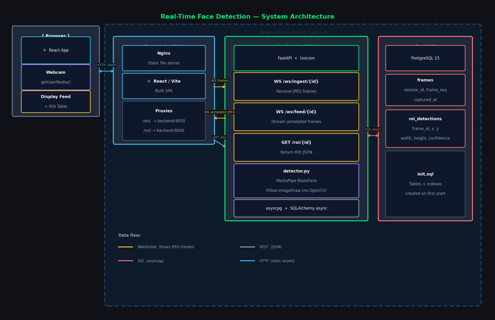

# Real-Time Face Detection System

A containerised video streaming pipeline that detects faces in real time, draws a bounding box (ROI) on each frame, stores detection data in PostgreSQL, and streams the annotated feed to a React frontend — all without using OpenCV.



---

## Quick Start

**Requirements:** Docker Desktop, Git

```bash
git clone https://github.com/Sanskar84/Real_time_face_detection.git
cd Real_time_face_detection

cp .env.example .env          # default values work out of the box

docker compose up --build
```

| Service | URL |
|---|---|
| Frontend | http://localhost:3000 |
| API docs (Swagger) | http://localhost:8000/docs |
| Health check | http://localhost:8000/health |

> First build downloads the BlazeFace TFLite model (~820 KB) and Node/Python dependencies — allow ~5 minutes.

Press **Start** in the browser, allow camera access, and the annotated feed appears with a green bounding box around the detected face.

---

## Stack

| Layer | Technology |
|---|---|
| Backend | Python 3.11, FastAPI, Uvicorn |
| Face detection | MediaPipe BlazeFace (no OpenCV) |
| ROI drawing | Pillow `ImageDraw.rectangle()` |
| Database | PostgreSQL 15, SQLAlchemy async, asyncpg |
| Frontend | React 18, Vite, Nginx |
| Transport | WebSockets (frames), REST (ROI data) |
| Containers | Docker Compose |

---

## API Endpoints

| Method | Path | Description |
|---|---|---|
| `WS` | `/ws/ingest/{session_id}` | Receive raw JPEG frames from the client |
| `WS` | `/ws/feed/{session_id}` | Stream annotated JPEG frames to the frontend |
| `GET` | `/roi/{session_id}` | Return stored ROI detections for a session |
| `GET` | `/health` | Liveness probe |

### ROI response shape

```json
{
  "session_id": "uuid",
  "total": 42,
  "detections": [
    {
      "frame_seq": 0,
      "x": 120, "y": 80, "width": 200, "height": 220,
      "confidence": 0.97,
      "captured_at": "2026-05-08T10:00:00Z"
    }
  ]
}
```

Supports `?limit=N&offset=N` pagination.

---

## Database Schema

```
frames
  id           BIGSERIAL PK
  session_id   UUID          -- groups frames from one stream session
  frame_seq    INTEGER       -- 0-based frame number
  captured_at  TIMESTAMPTZ

roi_detections
  id           BIGSERIAL PK
  frame_id     BIGINT FK → frames.id  (CASCADE DELETE)
  x, y         INTEGER       -- top-left corner of bounding box
  width, height INTEGER      -- box dimensions in pixels
  confidence   REAL          -- detector score 0–1 (nullable)
  created_at   TIMESTAMPTZ
```

---

## Running Tests

```bash
docker compose exec backend python -m pytest tests/ -q
```

13 tests covering:
- Unit tests for face detection + ROI drawing (MediaPipe mocked)
- Integration tests for the REST endpoint using an in-memory SQLite DB

---

## Project Structure

```
.
├── backend/
│   ├── app/
│   │   ├── main.py        # FastAPI app, CORS, lifespan
│   │   ├── config.py      # Pydantic settings from env
│   │   ├── database.py    # Async SQLAlchemy engine + get_db()
│   │   ├── models.py      # ORM models (Frame, RoiDetection)
│   │   ├── schemas.py     # Pydantic response models
│   │   ├── detector.py    # MediaPipe detection + Pillow drawing
│   │   └── routers/
│   │       ├── stream.py  # WS ingest + feed endpoints
│   │       └── roi.py     # GET /roi/{session_id}
│   ├── tests/
│   ├── Dockerfile
│   └── requirements.txt
├── frontend/
│   ├── src/
│   │   ├── App.jsx
│   │   ├── hooks/         # useStream, useRoi, useTheme
│   │   └── components/    # VideoPane, RoiTable
│   ├── nginx.conf
│   └── Dockerfile
├── db/
│   └── init.sql           # Schema created on first Postgres start
├── architecture.png
└── docker-compose.yml
```

---

## Environment Variables

Documented in `.env.example`. Copy to `.env` before running.

| Variable | Default | Description |
|---|---|---|
| `POSTGRES_USER` | `facedetect` | DB username |
| `POSTGRES_PASSWORD` | `changeme_in_prod` | DB password — **change in production** |
| `POSTGRES_DB` | `facedetect_db` | Database name |
| `ALLOWED_ORIGINS` | `http://localhost:3000` | CORS allowed origins |
| `VITE_WS_URL` | `ws://localhost:8000` | WebSocket base URL for frontend |
| `VITE_API_URL` | `http://localhost:8000` | REST base URL for frontend |
